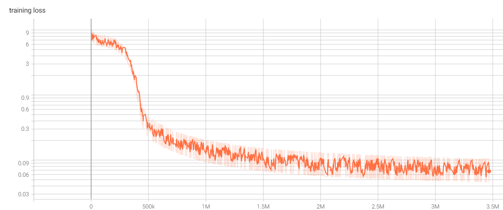
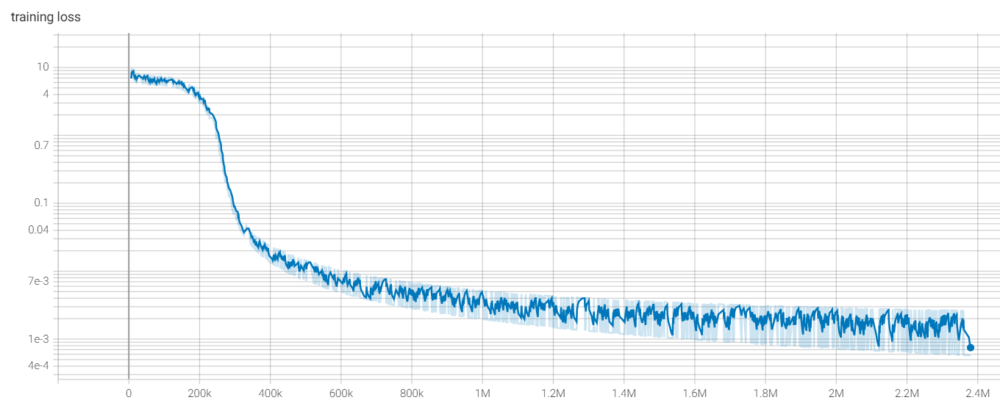

# Word embeddings

Example of creating word embeddings with ngram and CBOW model using pytroch.

## Requirements

Have to be installed **python 3.9**. Install required libraries using requirements.txt and pip.

## Training 

Model trained on 1000 epochs, Intel Core i5 2.40Ghz CPU. For training data used first chapter of Harry Potter book.

## Results

### Ngram model

### CBOW model

## Further improvements

For further improvements we can collect more text, train longer, tune hyperparameters, update model architecture and use more computer power.

## Useful resources

[1] https://towardsdatascience.com/stemming-vs-lemmatization-2daddabcb221
